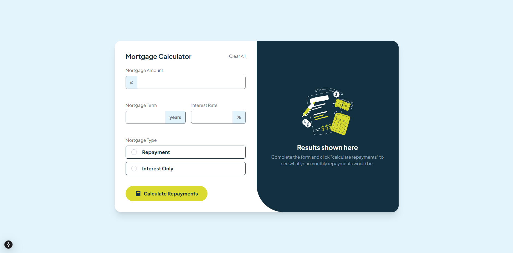

# Frontend Mentor - Mortgage repayment calculator solution

This is a solution to the [Mortgage repayment calculator challenge on Frontend Mentor](https://www.frontendmentor.io/challenges/mortgage-repayment-calculator-Galx1LXK73). Frontend Mentor challenges help you improve your coding skills by building realistic projects.

## Table of contents

- [Overview](#overview)
  - [The challenge](#the-challenge)
  - [Screenshot](#screenshot)
  - [Links](#links)
- [My process](#my-process)
  - [Built with](#built-with)
  - [What I learned](#what-i-learned)
  - [Continued development](#continued-development)
  - [Useful resources](#useful-resources)
- [Author](#author)
- [Acknowledgments](#acknowledgments)

## Overview

### The challenge

Users should be able to:

- Input mortgage information and see monthly repayment and total repayment amounts after submitting the form
- See form validation messages if any field is incomplete
- Complete the form only using their keyboard
- View the optimal layout for the interface depending on their device's screen size
- See hover and focus states for all interactive elements on the page

### Screenshot

Desktop


Mobile


### Links

- Solution URL: [Add solution URL here](https://your-solution-url.com)
- Live Site URL: [Add live site URL here](https://your-live-site-url.com)

## My process

### Built with

- Semantic HTML5 markup
- CSS custom properties
- TypeScript
- Flexbox
- CSS Grid
- Mobile-first workflow
- [React](https://reactjs.org/) - JS library
- [Next.js](https://nextjs.org/) - React framework
- [Tailwind CSS](https://tailwindcss.com) - CSS Library

### What I learned

This project had teached me how to use style parent and sibling elements of an input using **_peer_**, and **_has_** in tailwind css.

```html
<label
  className="relative flex items-center w-full h-12 border border-darkCol rounded-lg gap-5 px-5 py-2 cursor-pointer hover:border-lightCol has-[:checked]:border-lightCol has-[:checked]:bg-veryLightCol"
  htmlFor="repayment"
>
  <input
    className="peer h-5 w-5 cursor-pointer appearance-none rounded-full border border-slate-300 checked:border-lightCol transition-all"
    type="radio"
    name="mortgageType"
    id="repayment"
    value="repayment"
    onChange="{handleChange}"
  />
  <span
    className="absolute bg-lightCol w-3 h-3 rounded-full opacity-0 peer-checked:opacity-100 transition-opacity duration-200 top-1/2 left-[30px] transform -translate-x-1/2 -translate-y-1/2"
  ></span>
  <p className="font-extrabold text-darkCol text-lg">Repayment</p>
</label>
```

### Continued development

### Useful resources

## Author

- Frontend Mentor - [@Dmino228](https://www.frontendmentor.io/profile/Dmino228)
- Twitter - [@Dmino228](https://x.com/Dmino228)
- Discord - [@Dmino](https://discord.com/users/450691197522935818)

## Acknowledgments
